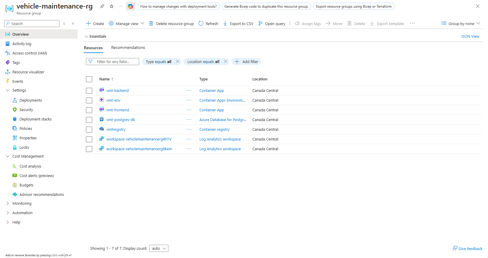
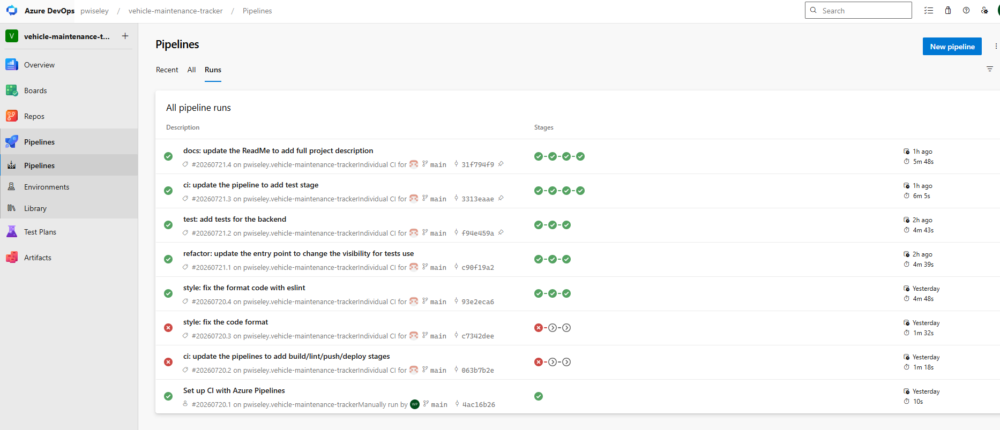
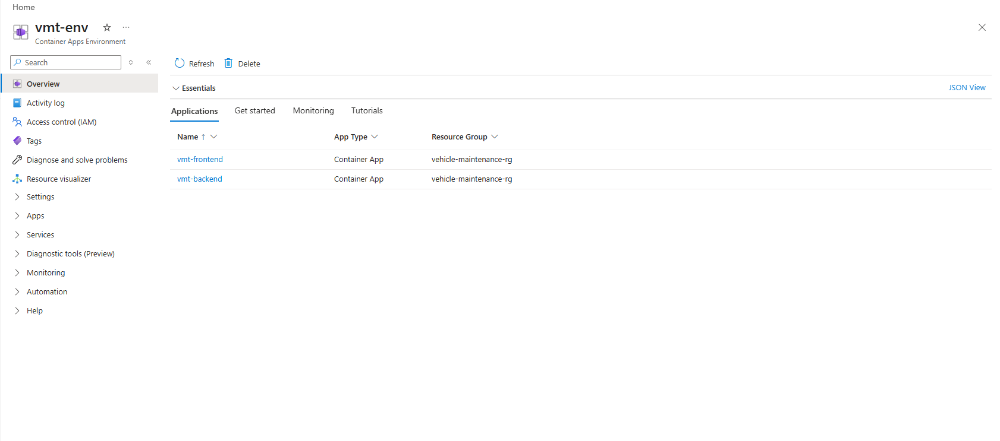

# 🔧 Vehicle Maintenance Tracker

> Fleet maintenance tracking API: logs service history per vehicle, tracks maintenance status, and surfaces fleet-wide metrics through a dashboard endpoint.

### [🚀 Live Demo](https://vmt.petiton.dev) · [📖 API Docs (Swagger)](https://vmt.petiton.dev/swagger)


---

## What it does

Vehicle Maintenance Tracker lets fleet operators register vehicles, log maintenance interventions against them, and follow each intervention through a status workflow (scheduled → in progress → completed). A dashboard endpoint aggregates fleet-wide metrics: total maintenance cost, upcoming interventions, and status distribution.

The app runs end to end in production: a containerized ASP.NET Core API and a React frontend deployed on Azure Container Apps behind an nginx reverse proxy, shipped through an Azure DevOps pipeline that builds, lints, tests, and deploys on every push to `main`.

---

## Tech Stack

| Layer | Technology |
|---|---|
| Backend | C#, ASP.NET Core 10, Entity Framework Core |
| Frontend | React, TypeScript, Vite |
| Database | PostgreSQL 16 |
| Testing | xUnit, Testcontainers, Respawn, FluentAssertions |
| CI/CD | Azure DevOps Pipelines |
| Hosting | Azure Container Apps, Azure Container Registry, nginx |
| Architecture | Controller / Service / DbContext |

---

## Key Features

- Vehicle registry with type classification (car, truck, snow plow, service vehicle)
- Maintenance history per vehicle with cost and mileage tracking
- Status workflow for each maintenance record
- Dashboard endpoint with LINQ-based aggregations
- RESTful API documented with Swagger / OpenAPI
- EF Core migrations for versioned schema changes
- Global exception handling with RFC 7807 ProblemDetails responses
- Integration test suite running against a real PostgreSQL via Testcontainers
- Automated build, lint, test, and deploy pipeline on Azure DevOps

---

## Getting Started

### Prerequisites

- [Docker](https://www.docker.com/) (required for the one-command run and for the test suite)
- [.NET 10 SDK](https://dotnet.microsoft.com/) and [Node.js 20+](https://nodejs.org/) (only for running services separately in dev)

First, create your environment file from the template:

```bash
cp .env.template .env
# then edit .env with your own database name, user, and password
```

### Run everything with Docker (one step)

Spins up PostgreSQL, the backend, and the frontend together:

```bash
docker compose up --build
```

- Frontend → http://localhost:3000
- Backend API → http://localhost:8080
- Swagger UI → http://localhost:8080/swagger

### Run the services separately (dev mode)

**1. Database** (Docker, just PostgreSQL):

```bash
docker compose up postgres
```

**2. Backend** (from `backend/`):

```bash
cd backend
dotnet restore
dotnet run
```

**3. Frontend** (from `frontend/`):

```bash
cd frontend
npm install
npm run dev
```

### Run the tests

The suite uses Testcontainers, so **Docker must be running**. It spins up a disposable PostgreSQL, applies migrations, and resets state between tests with Respawn.

```bash
cd backend.Tests
dotnet test
```

### Run the linters

```bash
# Backend (from backend/)
dotnet format --verify-no-changes

# Frontend (from frontend/)
cd frontend
npm run lint
```

---

## API Endpoints

| Method | Route | Purpose |
|---|---|---|
| `POST` | `/api/vehicles` | Register a vehicle |
| `GET` | `/api/vehicles` | List all vehicles |
| `GET` | `/api/vehicles/{id}` | Get vehicle details |
| `POST` | `/api/vehicles/{id}/maintenance` | Log a maintenance record |
| `GET` | `/api/vehicles/{id}/maintenance` | List a vehicle's maintenance history |
| `PATCH` | `/api/maintenance/{id}/status` | Advance maintenance status |
| `GET` | `/api/dashboard` | Fleet-wide metrics |

Full interactive documentation is available at **[/swagger](https://vmt.petiton.dev/swagger)**.

---

## API Examples

### Request — register a vehicle

```http
POST /api/vehicles
Content-Type: application/json
```

```json
{
  "plateNumber": "ABC123",
  "make": "Toyota",
  "model": "Corolla",
  "year": 2022,
  "mileage": 45000,
  "type": "Car"
}
```

### Successful response — `201 Created`

```json
{
  "id": 1,
  "plateNumber": "ABC123",
  "make": "Toyota",
  "model": "Corolla",
  "year": 2022,
  "mileage": 45000,
  "type": "Car",
  "maintenanceCount": 0
}
```

### Error response — `409 Conflict` (duplicate plate number)

Errors follow the [ProblemDetails](https://datatracker.ietf.org/doc/html/rfc7807) format:

```json
{
  "title": "Resource already exists",
  "status": 409,
  "detail": "A vehicle with plate number 'ABC123' already exists."
}
```

See the full request/response schemas at **[/swagger](https://vmt.petiton.dev/swagger)**.

---

## Deployment on Azure

The application is deployed on Azure Container Apps, with images built and stored in Azure Container Registry and shipped through an Azure DevOps pipeline.







---

## Related

- [insurance-quote](https://github.com/pwiseley/insurance-quote): Spring Boot + React, live at `primio.petiton.dev`
- [url-shortener](https://github.com/pwiseley/url-shortener): Spring Boot + Angular, live at `go.petiton.dev`
- [Floppa Marketplace](https://github.com/pwiseley/Floppa-app): Java REST API, three-layer architecture, CI/CD
- [Portfolio](https://petiton.dev)